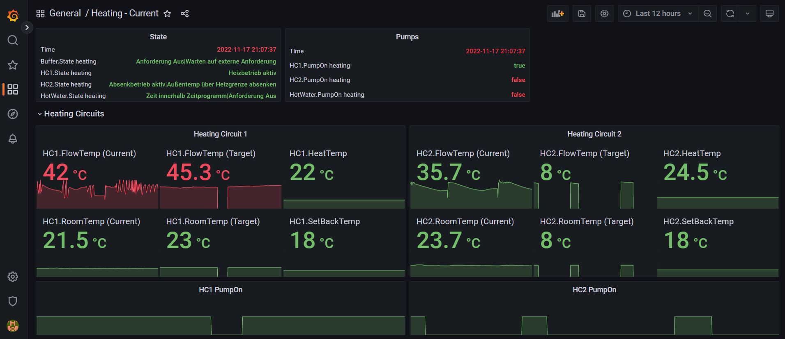
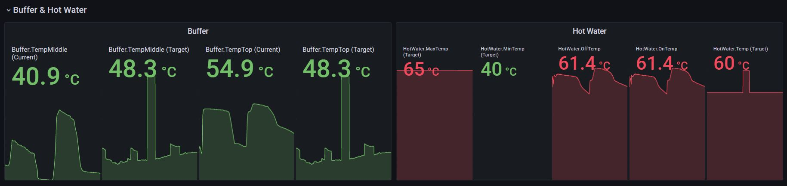
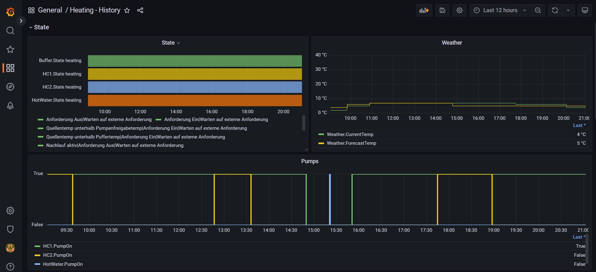
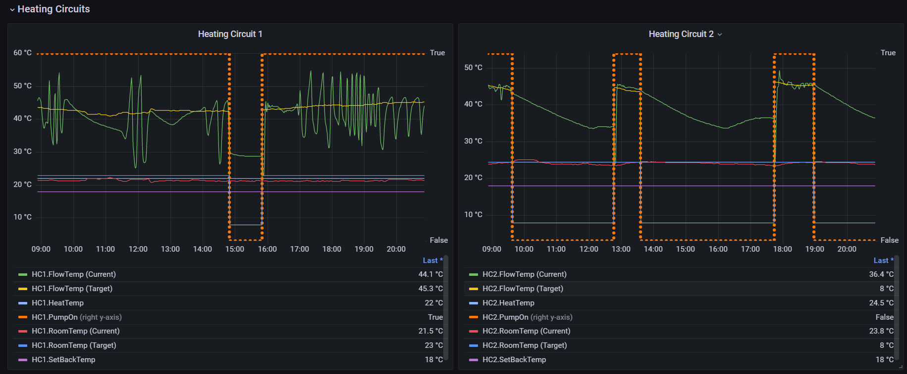
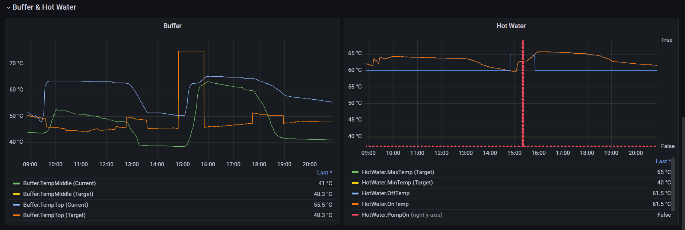
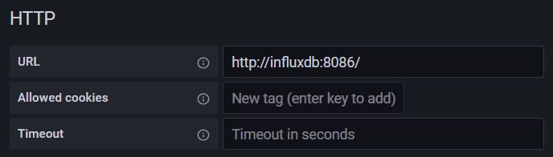
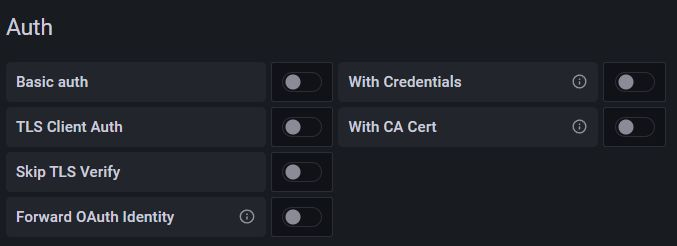
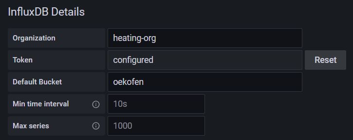

# Ökofen Statistics

This project is intended to provide a solution for easily collect data from Ökofen heating systems and visualize it for
short-, mid- and long-term analytics.

## Goals

This project has following goals

- **plug and play**: it should be easy to install and configure
- **resource-efficient**: it should be able to run on a Raspberry PI 2 Model B or better
- **adaptable**: it should be easy to adapt to the specific configurations of Ökofen systems

## Impressions

### Current View





### History View







## Quick Start

### Step 1: Download docker compose resources

Option 1: clone this repository
```git clone https://github.com/wernerfragner/oekofen-stats.git```

Option 2: download the folder 'docker' from this repository and extract the content to a location of your choice.

### Step 2: Modify settings

- Configure collector-app using 'collector-app.env'. All variables that MUST be defined are marked with '<' and '>' (
  e.g., 'COLLECT_SOURCE_PASSWORD=\<pass\>').
- Configure collector-app data collection and transformations using the files in folder 'collector-app-config'.
- Optional: Configure InfluxDB using 'influxdb.env' and the files in folder 'influxdb-config'.

### Step 3: Copy docker compose resources to Raspberry PI

NOTE: Raspberry PI must have docker and docker-compose installed. In the test setup a Raspberry PI 2 Model B and Ubuntu
21.10 (GNU/Linux 5.13.0-1028-raspi armv7l) has been used.

On Windows use a tool like [WinSCP](https://winscp.net/eng/download.php) to transfer the 'docker' folder to Raspberry
PI.
Then start the solution using
```docker compose up```
in the 'docker' directory.

### Step 4: Import Grafana Dashboards

- Open your browser and login into Grafana using the IP of your Raspberry and the port 9000 (
  e.g., http://192.168.0.100:9000/). Default login: admin/password
- Configure a new DataSource named 'InfluxDB'
    - 
    - 
    - 
    - 
- Import the dashboards located in folder 'docker/grafana-dashboards' -
  see [Grafana Import/Export Documentation](https://grafana.com/docs/grafana/latest/dashboards/manage-dashboards/#export-and-import-dashboards)
  . NOTE: in case you have defined an other name for the DataSource then you have to change the name also in the JSON
  files of the dashboards!

## Links

- https://gitlab.com/p3605/oekofen-spy
- https://github.com/thannaske/oekofen-json-documentation
- https://www.heise.de/ct/artikel/Docker-einrichten-unter-Linux-Windows-macOS-4309355.html

## Appendix

### Install docker on Raspberry PI Linux

Download install script:
```curl -fsSL https://get.docker.com -o get-docker.sh```

Execute Script:
```sudo sh get-docker.sh```

Add current user to group 'docker':
```sudo usermod -aG docker $USER```

Log off and log on current user in order that changes take effect.

### Install docker-compose on Raspberry PI Linux

Create a folder to store docker-compose binaries:
```mkdir -p ~/.docker/cli-plugins/```

Go to the release site in order to lookup the most current version:  https://github.com/docker/compose/releases/

Download the most current version into the previously created folder:
```curl -SL https://github.com/docker/compose/releases/download/v2.2.2/docker-compose-linux-armv7 -o ~/.docker/cli-plugins/docker-compose```

Make docker-compose executable:
```chmod +x ~/.docker/cli-plugins/docker-compose```